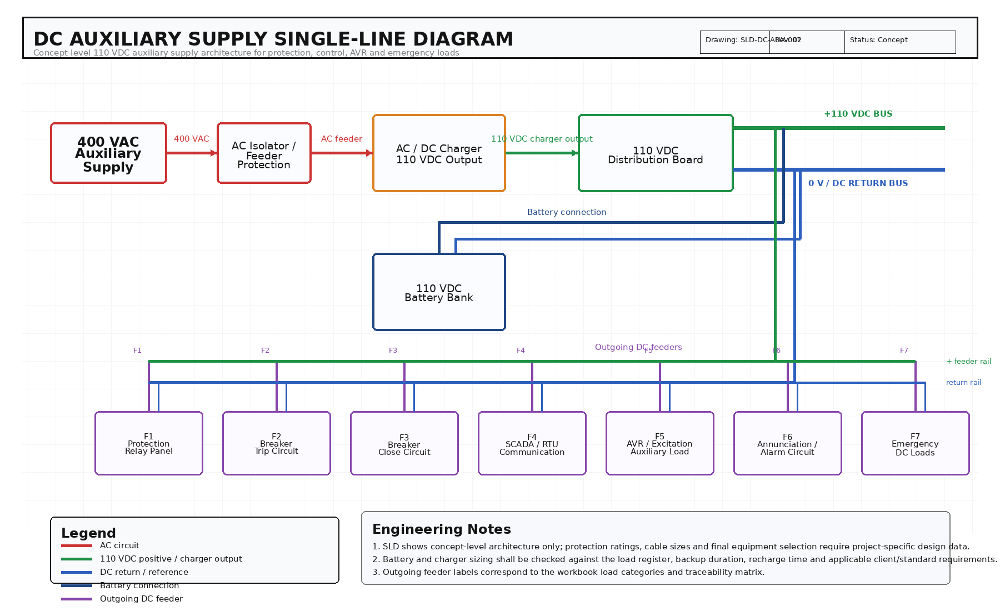

# DC Auxiliary Supply Sizing Workbook

A structured Excel-based engineering workbook for concept-level sizing of DC auxiliary supply systems used in power-plant, substation, protection, control, and emergency power applications.

This project demonstrates how DC loads can be organized, documented, calculated, and checked in a transparent engineering workflow. It combines a load register, battery capacity sizing, charger sizing, voltage-drop verification, formula documentation, source-basis notes, and requirement traceability in one workbook.

## Why This Project Matters

Reliable DC auxiliary supply is essential for protection, control, monitoring, tripping, closing, communication, and emergency functions in electrical power systems. Even when the AC supply is unavailable, critical DC loads such as protection relays, breaker trip coils, SCADA / RTU equipment, annunciation circuits, and AVR / excitation-related auxiliary systems must remain available.

This workbook provides a practical calculation framework for understanding how these loads are identified and translated into battery and charger sizing requirements.

## Project Scope

The workbook includes:

* DC load register for continuous and intermittent loads
* Battery Ah sizing calculation
* Battery energy estimation
* Charger current and charger power calculation
* Cable voltage-drop check
* Protection relay and AVR auxiliary load notes
* Source-basis and assumption documentation
* Formula explanation sheet
* Requirement traceability matrix
* Basic DC auxiliary supply architecture

## Key Engineering Features

### 1. Load Register

The load register separates DC consumers into clear engineering categories, including:

* Protection relay panels
* Trip and close circuits
* SCADA / RTU and communication loads
* Annunciation and alarm circuits
* AVR / excitation controller auxiliary loads
* Emergency DC loads

Editable input cells are highlighted, making it easy to replace example values with project-specific data.

### 2. Battery Sizing

The battery sizing sheet calculates the required ampere-hour capacity based on:

* DC system voltage
* Continuous load current
* Intermittent load contribution
* Backup duration
* Battery efficiency
* Depth of discharge
* Design margin

The calculation structure helps show how a load profile is converted into a battery capacity requirement.

### 3. Charger Sizing

The charger sizing sheet estimates the required charger rating by considering:

* Continuous DC load
* Battery recharge current
* Recharge time
* DC system voltage
* Charger power requirement

This gives a practical view of how charger sizing is linked to both normal DC loads and battery recovery after discharge.

### 4. Cable Voltage-Drop Check

The voltage-drop sheet provides a simple check for DC cable runs using:

* Load current
* Cable length
* Cable resistance
* DC system voltage
* Allowable voltage-drop limit

This supports early-stage validation of whether a selected cable route and conductor size are reasonable.

### 5. Protection and AVR Notes

A dedicated notes section explains the relevance of DC auxiliary supply for:

* Protection relay power supply
* Breaker trip circuits
* Breaker closing circuits
* SCADA / RTU systems
* Annunciation circuits
* AVR / excitation controller auxiliary loads
* Emergency control and monitoring loads

This connects the calculation workbook to practical power-system engineering use cases.

## Workbook Structure

| Sheet                | Purpose                                                |
| -------------------- | ------------------------------------------------------ |
| README               | Overview and usage guidance                            |
| Source_Basis         | Assumptions, references, and source basis              |
| Load_Register        | Editable DC load list                                  |
| Battery_Sizing       | Battery Ah and energy calculation                      |
| Charger_Sizing       | Charger current and power calculation                  |
| Cable_VDrop          | Cable voltage-drop check                               |
| Protection_AVR_Notes | Notes on protection and AVR-related DC auxiliary loads |
| Architecture         | Basic DC auxiliary supply architecture                 |
| Traceability         | Requirement coverage matrix                            |
| Calc_Steps           | Formula explanation and calculation logic              |

## Color Coding

| Color       | Meaning                                   |
| ----------- | ----------------------------------------- |
| Yellow      | Editable input cells                      |
| Green       | Calculated formula/output cells           |
| Blue / grey | Headings, notes, and documentation fields |

## Main Calculation Logic

```text
Total continuous current = sum of all continuous DC load currents

Equivalent intermittent current = load current × operating duration / backup duration

Required Ah = total equivalent current × backup duration

Adjusted Ah = Required Ah / (Efficiency × Depth of Discharge) × Design Margin

Battery recharge current = adjusted Ah / recharge time

Charger current = continuous load current + battery recharge current

Charger power = DC system voltage × charger current

Voltage drop = 2 × current × cable length × resistance per meter

Voltage drop percentage = voltage drop / DC system voltage × 100
```

## How to Use the Workbook

1. Open the Excel workbook.
2. Review the `Source_Basis` sheet to understand the example assumptions.
3. Go to `Load_Register` and edit the yellow input cells.
4. Update load currents, quantities, operating duration, and backup duration using project-specific or vendor datasheet values.
5. Review the calculated outputs in the battery, charger, and cable voltage-drop sheets.
6. Check the `Calc_Steps` sheet for formula explanation.
7. Use the `Traceability` sheet to confirm which engineering requirements are covered.

## Important Engineering Note

This workbook is intended for concept-level engineering study and portfolio demonstration. The included example values are not a substitute for project-specific design data. For real engineering work, equipment quantities, load currents, cable lengths, backup duration, selected ratings, voltage-drop limits, and battery data must be replaced with values from project specifications, vendor datasheets, applicable standards, and client requirements.

## Intended Use

This project demonstrates a structured approach to electrical engineering calculation, documentation, and traceability for DC auxiliary supply systems. It is suitable as a portfolio project for roles involving electrical design, power systems, protection and control, substations, power plants, renewable energy systems, and industrial electrical infrastructure.

## Single-Line Diagram

The repository includes an AutoCAD-compatible DXF single-line diagram for a concept-level 110 VDC auxiliary supply system. The drawing shows the 400 VAC auxiliary input, AC/DC charger, 110 VDC distribution board, battery bank, and outgoing DC feeders for protection relay panel, trip circuit, close circuit, SCADA/RTU, AVR/excitation auxiliary load, annunciation, and emergency DC loads.


